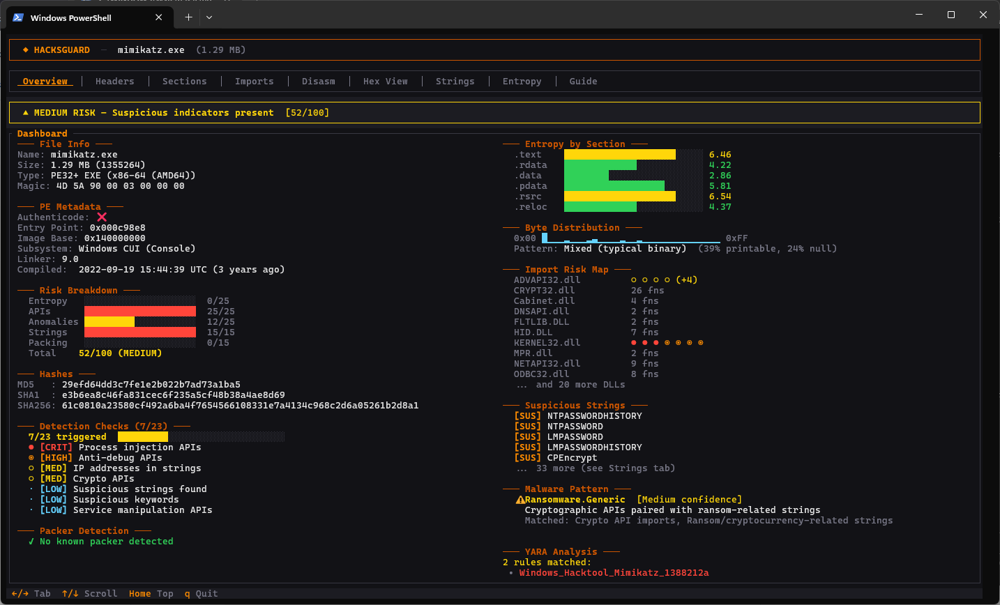

# HacksGuard - Blazing Fast TUI Malware Analysis Tool 🛡️




HacksGuard is a blazingly fast, multi-threaded Terminal UI (TUI) static analysis tool designed for SOC analysts, threat hunters, and reverse engineers. Built entirely in Rust, it provides an intuitive dashboard for quick triage and deep inspection of Portable Executable (PE) files right from your terminal.

## 🌟 Key Features

- **Blazing Fast & Multi-Threaded**: The core analysis pipeline (PE parsing, YARA scanning, and entropy calculation) runs concurrently. This ensures zero UI latency, even when analyzing large executables.
- **Advanced Risk Scoring**: HacksGuard automatically compiles a 0-100% Risk Score based on 5 heuristic axes (Entropy, Suspicious APIs, PE Anomalies, Strings, and Packing), visualized beautifully through an interactive radar chart.
- **Integrated YARA Engine**: Powered by the `boreal` crate, HacksGuard dynamically loads local YARA rules (e.g., Elastic protections-artifacts) to detect known threats, packers, and evasion techniques.
- **Deep PE Inspection**: Comprehensive breakdown of the PE format, including Headers, Sections, Imports (categorized by severity), Exports, Security Mitigations (ASLR, DEP, CFG), and Authenticode verification.
- **Visual Entropy Graph**: A dedicated Entropy tab plots the Shannon entropy distribution of the file using sparklines, allowing analysts to visually spot encrypted or packed payloads instantly.
- **Auto-Decoding Strings**: Automatically extracts and categorizes strings (IPs, URLs, Registry keys). Suspicious strings matching the Base64 alphabet are decoded on the fly directly in the interface.
- **Built-in Disassembler & Hex View**: Inspect raw x86/x64 opcodes at the Entry Point via the `iced-x86` integration, or dive into raw bytes with the built-in Hex Dump viewer.
- **Overlay Detection**: Automatically detects appended hidden data at the end of the binary, a technique commonly used by droppers and malicious installers.
- **CLI Mode / CI-CD Ready**: Run `hacksguard --json <file>` to bypass the terminal UI and export the full analysis report as a structured JSON object for SIEM/SOAR integrations.

## 📦 Installation


### Building from source

Make sure you have Rust and Cargo installed, then run:

```bash
git clone https://github.com/your-username/hacksguard.git
cd hacksguard
cargo build --release
```
### Nixpkgs

For Nix or NixOS users is a [package](https://search.nixos.org/packages?channel=unstable&from=0&size=50&sort=relevance&type=packages&query=hacksguard)
available in Nixpkgs. Keep in mind that the lastest releases might only
be present in the ``unstable`` channel.

```bash
$ nix-env -iA nixos.hacksguard
```

The compiled binary will be available at `target/release/hacksguard`.

## 🚀 Usage

Run HacksGuard by providing the path to the executable you want to analyze:

```bash
cargo run --release -- <path/to/binary.exe>
```

### Keyboard Shortcuts

- `Tab` / `Right Arrow`: Next Tab
- `Shift+Tab` / `Left Arrow`: Previous Tab
- `Up` / `Down` / `k` / `j`: Scroll
- `PageUp` / `PageDown`: Fast Scroll
- `q` / `Esc`: Quit

## Dependencies

- `ratatui` & `crossterm` - TUI rendering
- `goblin` - PE/ELF parsing
- `boreal` - Pure Rust YARA engine
- `iced-x86` - Disassembler


## 🔗 Related Projects

- [Elastic Protections Artifacts](https://github.com/elastic/protections-artifacts) - YARA rules
